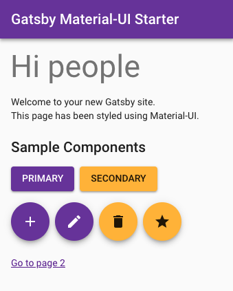

# Gatsby Material-UI Starter



Starter template for Gatsby using Material-UI (based on [Gatsby default starter](https://github.com/gatsbyjs/gatsby-starter-default/tree/v2). See live demo [here](https://gatsby-starter-material-ui.netlify.com/).

For an overview of the project structure please refer to the [Gatsby documentation - Building with Components](https://www.gatsbyjs.org/docs/building-with-components/).

The Material-UI theme is configured in `src/getPageContext.js`. This theme is propagated down a component tree using the `withRoot` HOC (see `src/withRoot.js`). Consequently, *top-level components* should be wrapped with this HOC. This will ensure that the theme is available to all the nested components. In this starter template, I have wrapped the `Layout` component with `withRoot` - it is the root component used by all pages. 

Additionally, if you create your own JSS styles in a component, you need to wrap it with the `withStyles` HOC in order to pass your custom styles down (e.g. `src/components/layout.js`).

I have also provided a way to create global styles (see `src/styles/styles.css`). This allows you to style simple HTML markup, e.g. markup generated by Markdown. An alternate way to do this is using [gatsby-plugin-typography](https://www.gatsbyjs.org/packages/gatsby-plugin-typography/).

## Prerequisites

Make sure that you have the Gatsby CLI program installed:
```sh
npm install --global gatsby-cli
```

Dev Build
---------
```bash
$ yarn
$ gatsby develop
```

Now point your browser to http://localhost:8000/.

Production Build
----------------
```bash
$ gatsby build
```

Now deploy the public folder to your production web server.
